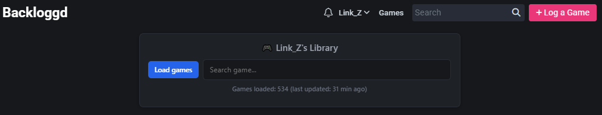

# Backloggd SearchBar

A Chrome extension that adds a powerful search functionality to your Backloggd game library. Search through all your games instantly without having to scroll through pages.

## Features

- 🔍 **Fast Search**: Search through your entire game library instantly
- 💾 **Local Caching**: Games are cached locally for quick access
- ⭐ **Rating Display**: See your ratings for each game in the results
- 🎨 **Dark Theme**: Matches Backloggd's interface seamlessly
- 🔄 **Auto-Update**: Works across page navigation within Backloggd

## Installation

1. Download or clone this repository
2. Open Chrome and go to `chrome://extensions/`
3. Enable **Developer mode** (toggle in the top right)
4. Click **Load unpacked** and select the **backloggd-extension** folder
5. Navigate to any Backloggd user profile page (e.g., `https://backloggd.com/u/yourusername`)

## Usage

1. Visit any user's game library on Backloggd (`https://backloggd.com/u/username`)
2. The search bar will appear at the top of the page
3. Click **Update** to cache all games from that user's library (this may take a few seconds for large collections)
4. Once loaded, start typing in the search box to filter games instantly
5. Click on any game link in the results to visit its page

## Screenshots

## How It Works

- The extension scrapes the user's game library pages and stores them locally in Chrome's storage
- Search is performed client-side for instant results
- Cache persists between sessions and shows when it was last updated
- Automatically reinjects itself when navigating between Backloggd pages

## Privacy

- All data is stored locally in your browser
- No external servers or tracking
- Only accesses Backloggd pages you visit
- Open source - you can review all the code

## Permissions

- `storage`: To cache your games locally for fast search

## Development

### Files
- `manifest.json`: Extension configuration
- `content.js`: Main functionality and UI injection

### To modify:
1. Make changes to the files
2. Go to `chrome://extensions/`
3. Click the refresh icon on the extension card

## Contributing

Feel free to open issues or submit pull requests!

## Credits

Created for the Backloggd community to enhance the game library browsing experience.

---

**Note**: This is an unofficial extension and is not affiliated with Backloggd.